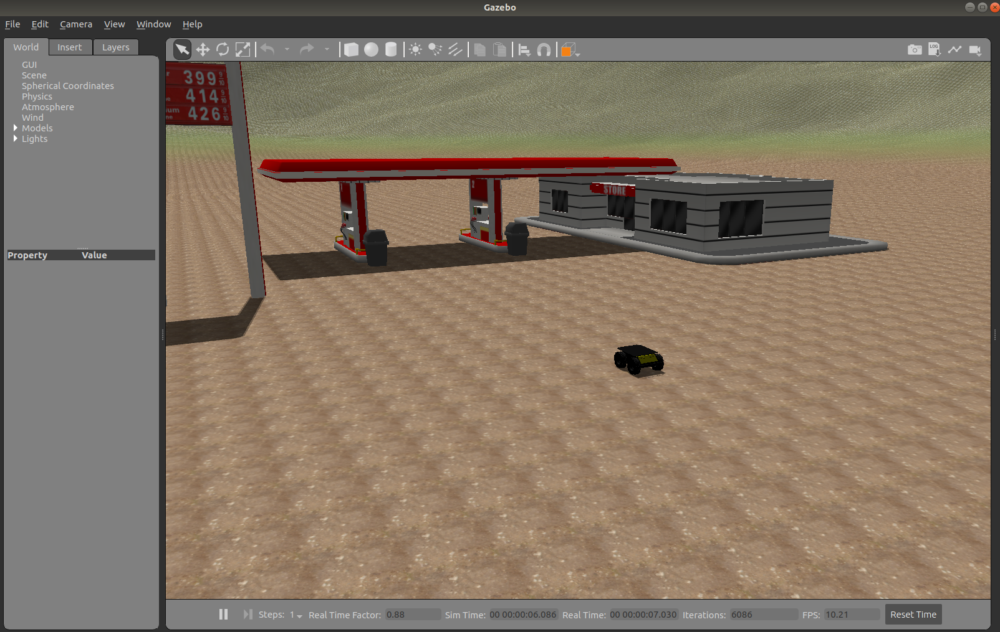
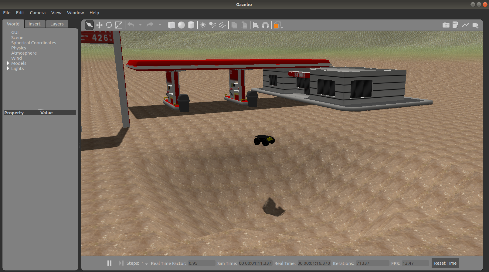
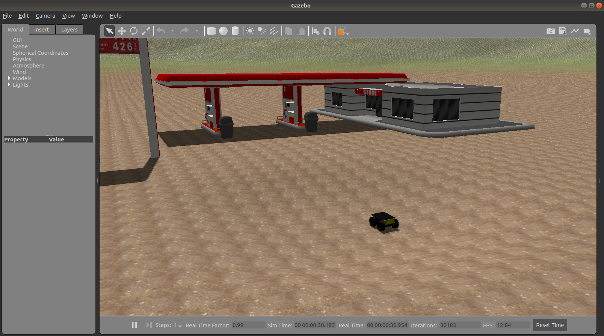
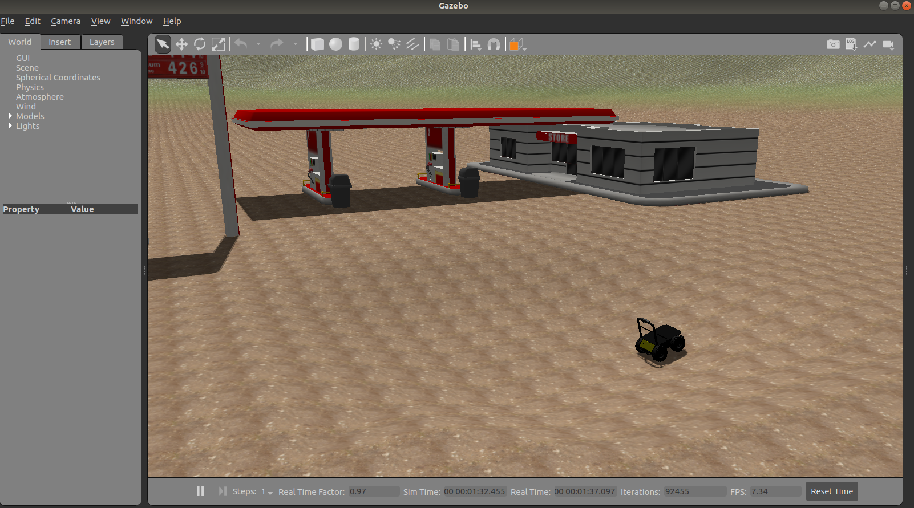

# introduction
A demo of dynamic terrain within ROS/Gazebo environment

# requirements

ROS distro: melodic  

Required Packages:
  - [ros-melodic-husky-desktop](https://wiki.ros.org/husky_desktop)
  - [ros-melodic-husky-simulator](http://wiki.ros.org/husky_gazebo)
  - [ros-melodic-teleop-twist-keyboard](http://wiki.ros.org/teleop_twist_keyboard)

# usage
Launch demo world using ```roslaunch dynamic_terrain terrain_world.launch```.  
To control the husky robot using a keyboard execute ```rosrun teleop_twist_keyboard teleop_twist_keyboard.py``` in another terminal.

# Screenshots
  

  
