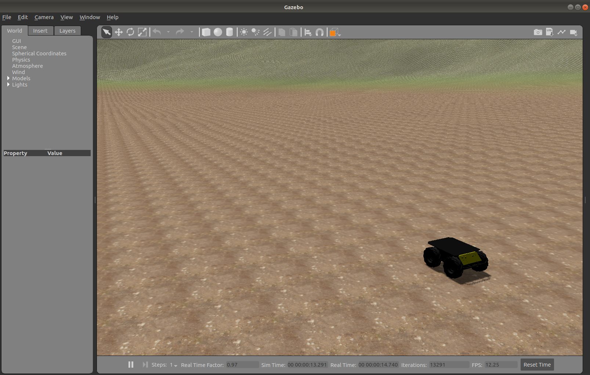

# introduction
A demo of dynamic terrain within ROS/Gazebo environment

# requirements

ROS distro: melodic  

Required Packages:
  - ros-melodic-husky-desktop
  - ros-melodic-husky-simulator
  - ros-melodic-teleop-twist-keyboard

# usage
Launch demo world using ```roslaunch dynamic_terrain terrain_world.launch```. Then in a separate console run ```rosrun teleop_twist_keyboard teleop_twist_keyboard.py``` to control the husky robot.

# Screenshots
